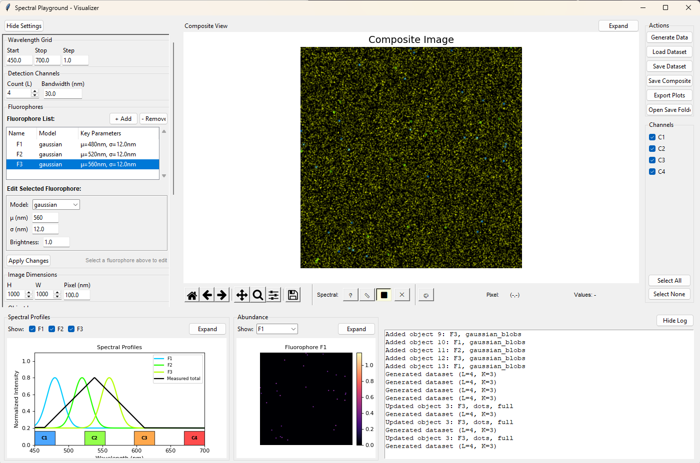

Spectral Simulator
==================

A desktop application for synthesizing and exploring synthetic multispectral fluorescence datasets. It is intended for prototyping spectral imaging configurations and visual analysis.



*Interactive GUI showing spectral profile design, spatial object placement, and real-time composite visualization*

## Core Features

### Spectral System Design
- **Wavelength Grid Configuration**: Define custom wavelength ranges (e.g., 400-700nm) with configurable step sizes
- **Detection Channel Setup**: Configure multiple detection channels with center wavelengths and bandwidths
- **Advanced Fluorophore Models**: Support for multiple spectral profile models:
  - Gaussian (mean, standard deviation)
  - Skewed normal (mean, std, skewness)
  - Log-normal (log-scale parameters)
  - Weibull (shape, scale, shift)
  - Mixture models and empirical data

### Spatial Object Placement
- **Interactive Object Editor**: Visual management of fluorophore spatial distributions
- **Multiple Object Types**: 
  - Gaussian blobs (configurable variance)
  - Filled circles and squares
  - Point sources (dots)
- **Region-Based Placement**: Restrict objects to specific areas:
  - Full image coverage
  - Rectangular regions (x, y, width, height)
  - Circular regions (center, radius)
- **Per-Fluorophore Control**: Independent spatial patterns for each fluorophore

### Real-Time Visualization
- **Composite RGB Rendering**: Wavelength-to-color mapping for intuitive viewing
- **Interactive Spectral Plots**: 
  - Fluorophore emission profiles
  - Channel response functions
  - Measured signal overlay
- **Individual Abundance Maps**: Per-fluorophore spatial distributions with colormap visualization
- **Expandable Views**: Full-screen modes for detailed inspection

### Simulation Controls
- **Background Models**: Constant or low-rank structured backgrounds
- **Image Dimensions**: Configurable field size and pixel resolution
- **Reproducible Results**: Seed-based random number generation

### Data Management
- **Full Dataset Export**: Complete spectral data saved as compressed `.npz` files with metadata
- **Composite Image Export**: High-resolution PNG/JPEG images for presentations
- **Plot Export**: Matplotlib figures saved in multiple formats (PNG, PDF, SVG)
- **Batch Processing**: Export all views and individual abundance maps simultaneously

## Installation

### Prerequisites
- Python 3.9 or later
- Required packages: numpy, scipy, matplotlib, tkinter (usually included with Python)

### Install from Source
```bash
git clone https://github.com/AntonVict/Spectral-Simulator.git
cd Spectral-Simulator
pip install -e .
```

Alternatively, install directly from GitHub:
```bash
pip install git+https://github.com/AntonVict/Spectral-Simulator.git
```

## Quick Start

### Launch the Application
```bash
python -m spectral_playground.gui.main_gui
```

### Basic Workflow
1. **Configure Spectral System** (left sidebar):
   - Set wavelength grid (start, stop, step)
   - Define detection channels (count, bandwidth)
   - Design fluorophore spectral profiles

2. **Design Spatial Layout**:
   - Use object layers manager to place fluorophores
   - Configure object types, counts, and regions
   - Apply changes to update the spatial distribution

3. **Generate and Visualize**:
   - Click "Generate Data" to synthesize the dataset
   - View composite image, spectral profiles, and abundance maps
   - Toggle channels and fluorophores for comparison

4. **Export Results**:
   - Save complete datasets for further analysis
   - Export publication-ready images and plots
   - Organize outputs in the `saved_data/` directory

## Application Architecture

### Core Simulation Engine (`spectral_playground/core/`)
- `spectra.py` - Spectral system modeling and fluorophore definitions
- `spatial.py` - Spatial object placement and abundance field generation
- `simulate.py` - Forward model implementation (Y = MA + B + N)
- `background.py` - Background signal modeling
- `noise.py` - Noise model implementation

### Data Management (`spectral_playground/data/`)
- `dataset.py` - Core data structures for synthetic datasets
- `image_io.py` - Comprehensive I/O for images, datasets, and plots
- `io.py` - Low-level file operations

### GUI Framework (`spectral_playground/gui/`)
- `main_gui.py` - Main application window and coordination
- `sidebar.py` - Configuration panels and controls
- `viewer.py` - Central visualization panel
- `bottom_panel.py` - Spectral plots and abundance views
- `views/` - Specialized visualization components
- `object_layers.py` - Spatial object management interface
- `fluorophore_editor.py` - Spectral profile configuration

### Visualization (`spectral_playground/vis/`)
- `plots.py` - Plotting utilities and figure generation

## File Organization

The application automatically creates a `saved_data/` directory structure:

```
saved_data/
├── datasets/          # Complete spectral datasets (.npz files)
├── images/           # Composite RGB renderings (.png, .jpg)
├── plots/            # Individual plot exports (.png, .pdf, .svg)
└── exports/          # Batch export collections
```

## Advanced Usage

### Custom Fluorophore Models
The application supports sophisticated spectral models beyond simple Gaussians:
- **Skewed Normal**: For asymmetric emission profiles
- **Log-Normal**: For naturally skewed biological fluorophores  
- **Weibull**: For flexible peak shapes with tunable asymmetry
- **Mixture Models**: Combine multiple peaks for complex spectra

### Spatial Pattern Design
Create realistic spatial distributions by combining:
- Multiple object types per fluorophore
- Region-based constraints (cellular compartments, tissue regions)
- Intensity variation controls for biological realism
- Scalable object sizes and densities

### Background Modeling
Simulate background structure using:
- Constant per-channel offsets
- Low-rank spatial patterns generated from random factors

## Technical Details

- **Forward Model**: Implements Y = MA + B + N where:
  - Y: Measured spectral data (L×P)
  - M: System matrix (L×K) 
  - A: Abundance maps (K×P)
  - B: Background (L×P)
  - N: Noise
- **Numerical Integration**: Spectral overlap computed via trapezoidal rule
- **Memory Efficient**: Streaming operations for large datasets
- **Cross-Platform**: Pure Python with standard scientific libraries

## Citation

If you use this software in your research, please cite it:

```bibtex
@software{victorin2025spectral,
  author = {Victorin, Anton},
  title = {Spectral Simulator},
  year = {2025},
  version = {0.1.0},
  url = {https://github.com/AntonVict/Spectral-Simulator},
  license = {MIT}
}
```

Alternatively, you can cite using the `CITATION.cff` file included in this repository, which is automatically recognized by GitHub and Zenodo.

## Contributing

Contributions are welcome! If you'd like to contribute:

1. Fork the repository
2. Create a feature branch (`git checkout -b feature/amazing-feature`)
3. Commit your changes (`git commit -m 'Add amazing feature'`)
4. Push to the branch (`git push origin feature/amazing-feature`)
5. Open a Pull Request

Please ensure your code follows the existing style and includes appropriate documentation.

## License

This project is licensed under the MIT License - see the [LICENSE](LICENSE) file for details.

This means you are free to use, modify, and distribute this software for any purpose, including commercial applications, as long as you include the original copyright notice.

## Version Information
- Current Version: 0.1.0
- Python Requirements: ≥3.9
- Key Dependencies: numpy≥1.24, scipy≥1.10, matplotlib≥3.6

